<table>
<thead>
<tr>
<th>CZ</th>
<th>HL2</th>
</tr>
</thead>
<tbody>
<tr>
<td>cncrt010  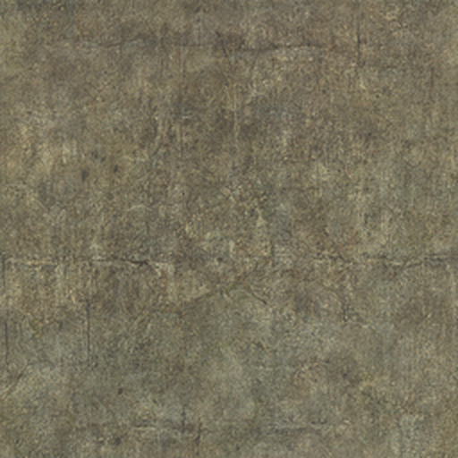</td>
<td>concretefloor004a 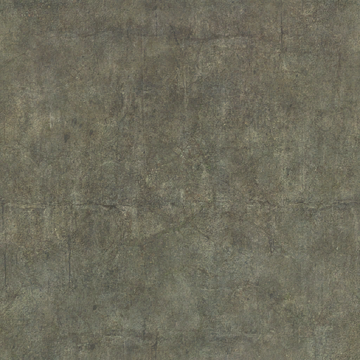</td>
</tr>
<tr>
<td>+4</td>
<td>+4</td>
</tr>
<tr>
<td>cncrt014  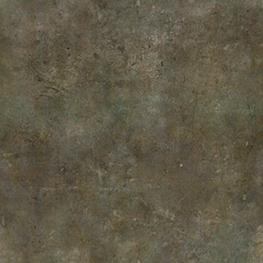</td>
<td>concretefloor008a </td>
</tr>
<tr>
<td>+13</td>
<td>+13</td>
</tr>
<tr>
<td>cncrt027 </td>
<td>concretefloor016a </td>
</tr>
<tr>
<td>+11</td>
<td><strong>+5?</strong></td>
</tr>
<tr>
<td>cncrt038 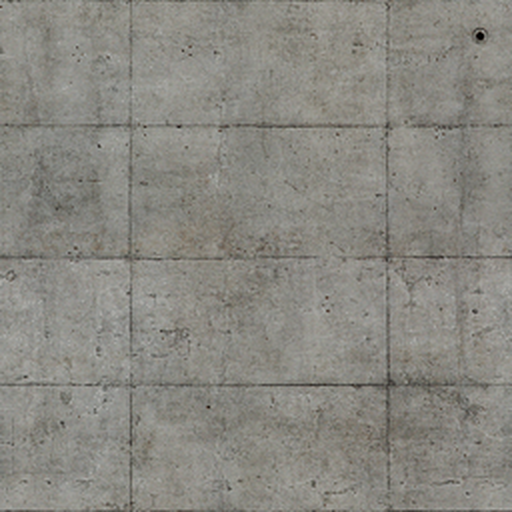</td>
<td>concretefloor023a </td>
</tr>
<tr>
<td>+15</td>
<td>+15</td>
</tr>
<tr>
<td>cncrt053 </td>
<td>concretefloor029a 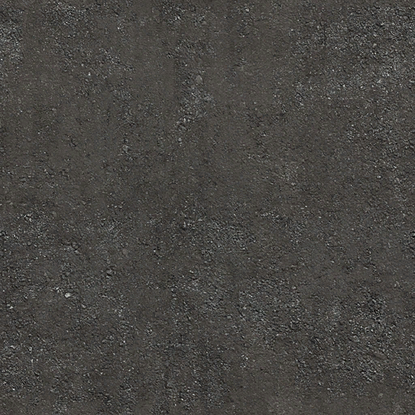</td>
</tr>
<tr>
<td>Series break</td>
<td></td>
</tr>
<tr>
<td>cncrt094 </td>
<td>concretestair002a 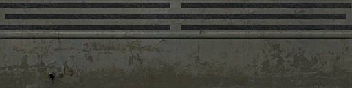</td>
</tr>
<tr>
<td>Series break</td>
<td></td>
</tr>
<tr>
<td>cncrt102 </td>
<td>concretewall001b </td>
</tr>
<tr>
<td>cncrt103 </td>
<td>concretewall001c 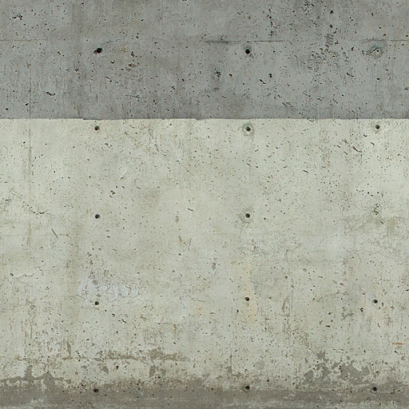</td>
</tr>
<tr>
<td>+4</td>
<td>+4</td>
</tr>
<tr>
<td>cncrt107 </td>
<td>concretewall002b </td>
</tr>
<tr>
<td>cncrt108 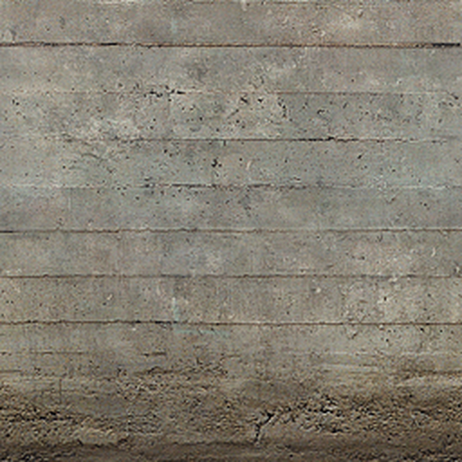</td>
<td>concretewall002c 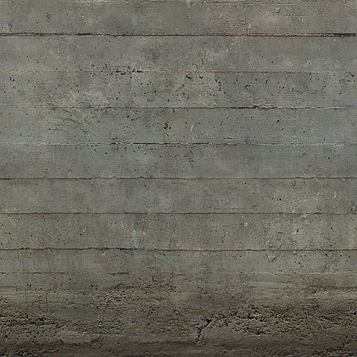</td>
</tr>
<tr>
<td>+18</td>
<td>+18</td>
</tr>
<tr>
<td>cncrt126 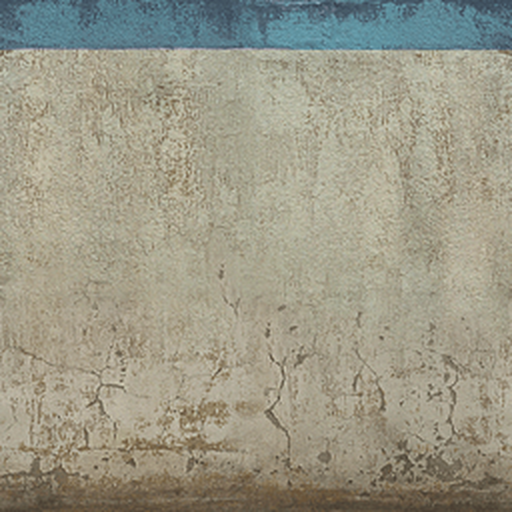</td>
<td>concretewall010a 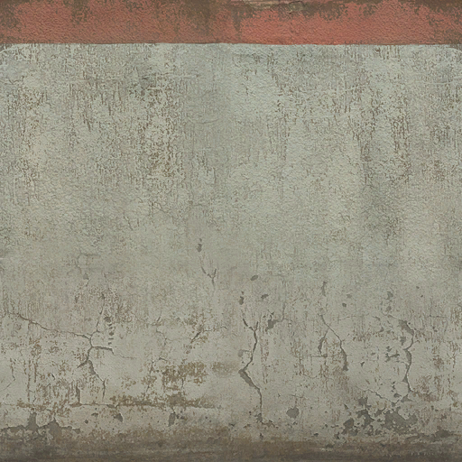</td>
</tr>
<tr>
<td>cncrt149 </td>
<td>concretewall015a </td>
</tr>
<tr>
<td>cncrt150 </td>
<td>concretewall015b 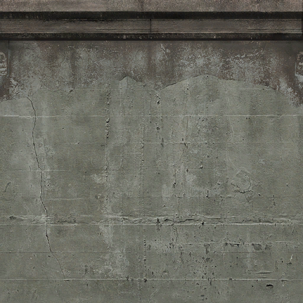</td>
</tr>
<tr>
<td>cncrt151 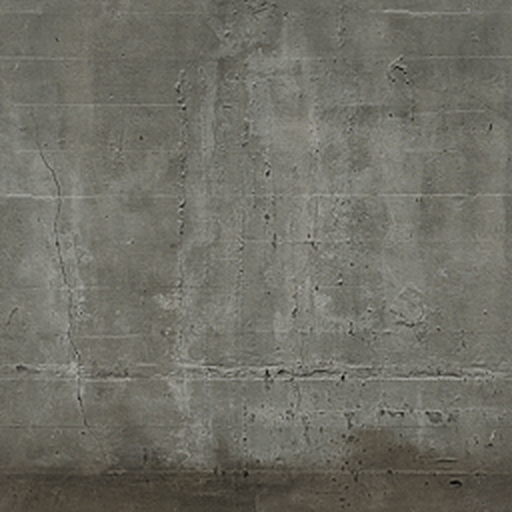</td>
<td>concretewall015c </td>
</tr>
<tr>
<td>+21</td>
<td>+46?</td>
</tr>
<tr>
<td>cncrt172 </td>
<td>concretewall020a  also   concretewall027a </td>
</tr>
<tr>
<td>+4</td>
<td>+4</td>
</tr>
<tr>
<td>cncrt176 </td>
<td>concretewall022a? No orig.</td>
</tr>
<tr>
<td>+24</td>
<td>+24</td>
</tr>
<tr>
<td>cncrt200 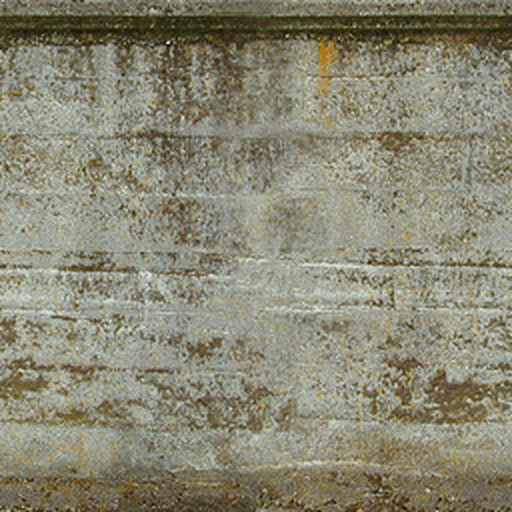</td>
<td>concretewall032a </td>
</tr>
<tr>
<td>+5</td>
<td>+5</td>
</tr>
<tr>
<td>cncrt205 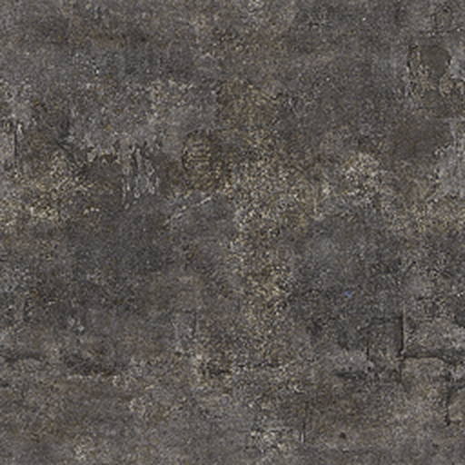</td>
<td>concretewall036a </td>
</tr>
<tr>
<td>+5</td>
<td>+5</td>
</tr>
<tr>
<td>cncrt210 </td>
<td>concretewall037d </td>
</tr>
<tr>
<td>+6</td>
<td>+6</td>
</tr>
<tr>
<td>cncrt216 </td>
<td>concretewall040a </td>
</tr>
<tr>
<td>+8</td>
<td>+11?</td>
</tr>
<tr>
<td>cncrt224 </td>
<td>concretewall042a 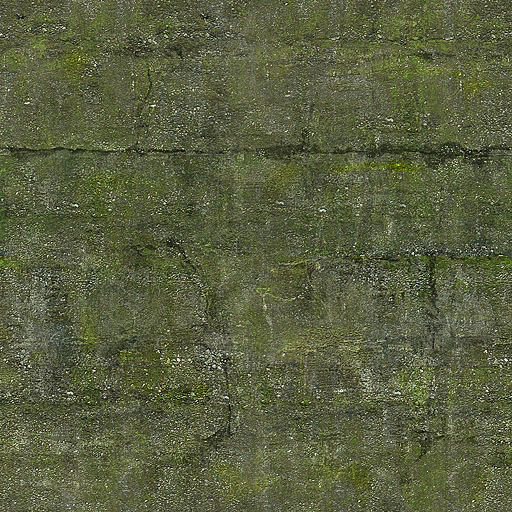</td>
</tr>
<tr>
<td>+11</td>
<td>+11</td>
</tr>
<tr>
<td>cncrt235 </td>
<td>concretewall047c </td>
</tr>
<tr>
<td>+3</td>
<td>+3 (049a assumed, but missing)</td>
</tr>
<tr>
<td>cncrt238 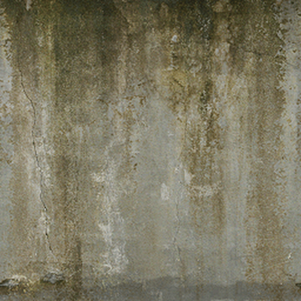</td>
<td>concretewall049b </td>
</tr>
<tr>
<td>+11</td>
<td>+10?</td>
</tr>
<tr>
<td>cncrt249 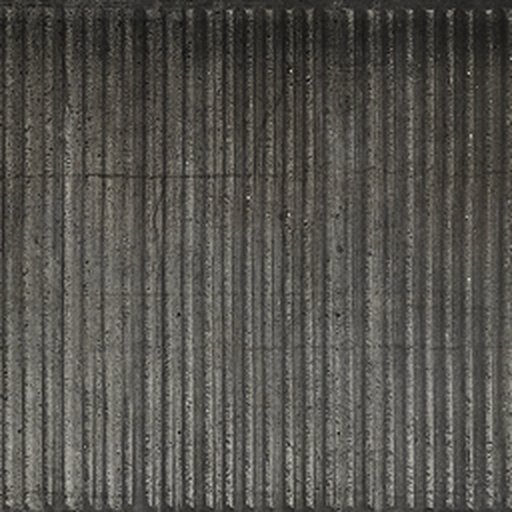</td>
<td>concretewall057b </td>
</tr>
<tr>
<td>cncrt250 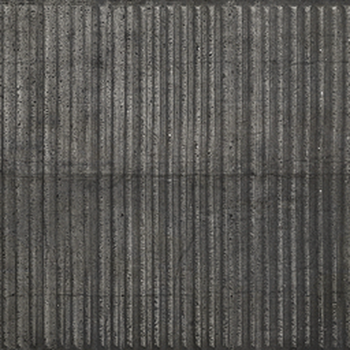</td>
<td>concretewall057c 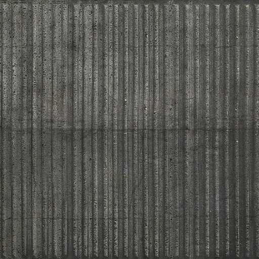</td>
</tr>
<tr>
<td>+15</td>
<td>+19?</td>
</tr>
<tr>
<td>cncrt265 </td>
<td>concretewall062a 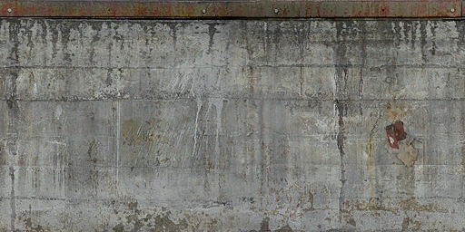</td>
</tr>
<tr>
<td>+2</td>
<td>+2 (063a missing</td>
</tr>
<tr>
<td>cncrt267 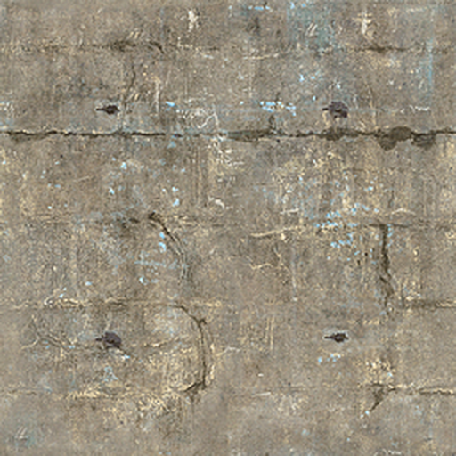</td>
<td>concretewall064a </td>
</tr>
<tr>
<td>+8</td>
<td>+8</td>
</tr>
<tr>
<td>cncrt275 </td>
<td>concretewall065a 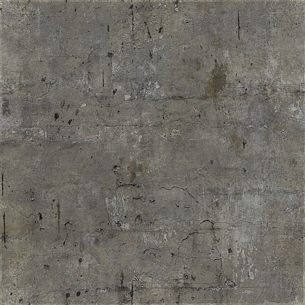</td>
</tr>
<tr>
<td>cncrt276 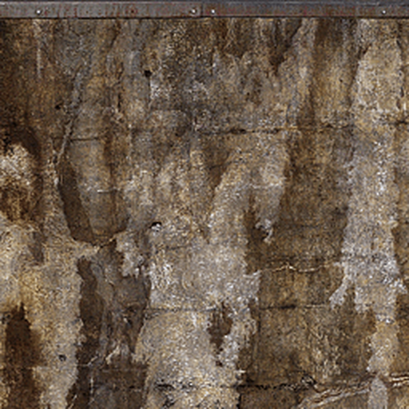</td>
<td>concretewall065b </td>
</tr>
<tr>
<td>Series break</td>
<td></td>
</tr>
<tr>
<td>mtl008 </td>
<td>metalceiling008a 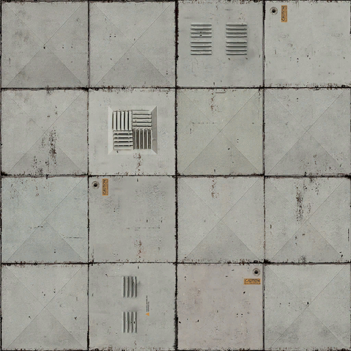</td>
</tr>
<tr>
<td>+46</td>
<td>+19? (+20 with missing metalceiling009a)</td>
</tr>
<tr>
<td>mtl054 </td>
<td>metaldoor018a </td>
</tr>
<tr>
<td>+36</td>
<td>+53?</td>
</tr>
<tr>
<td>mtl114 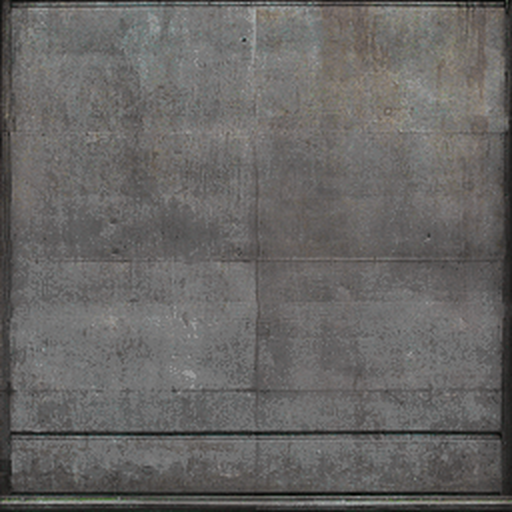</td>
<td>metaldoor059a 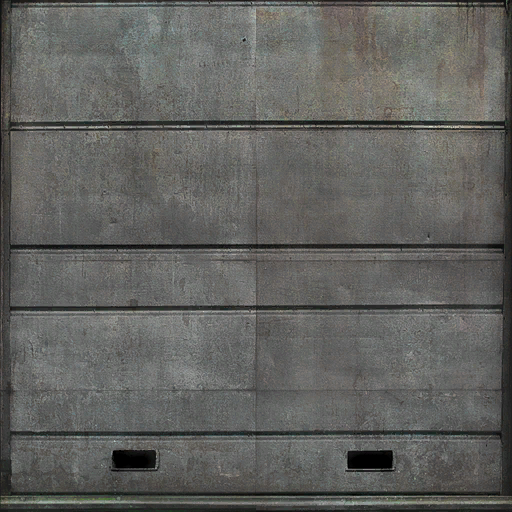</td>
</tr>
<tr>
<td>+60</td>
<td>+58?</td>
</tr>
<tr>
<td>mtl186 </td>
<td>metalhull006c 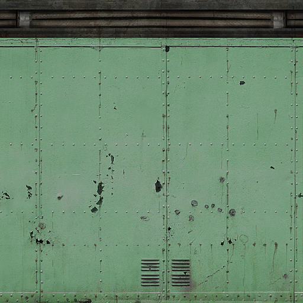</td>
</tr>
<tr>
<td>+2</td>
<td>+2</td>
</tr>
<tr>
<td>mtl188 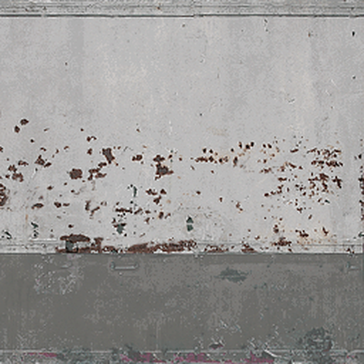</td>
<td>metalhull007b </td>
</tr>
<tr>
<td>+21</td>
<td>+21</td>
</tr>
<tr>
<td>mtl209 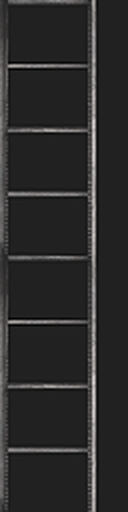</td>
<td>metalladder001a 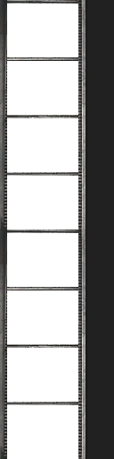</td>
</tr>
<tr>
<td><strong>+44</strong></td>
<td>+13?</td>
</tr>
<tr>
<td>mtl253 </td>
<td>metalpipe012a </td>
</tr>
<tr>
<td>mtl259 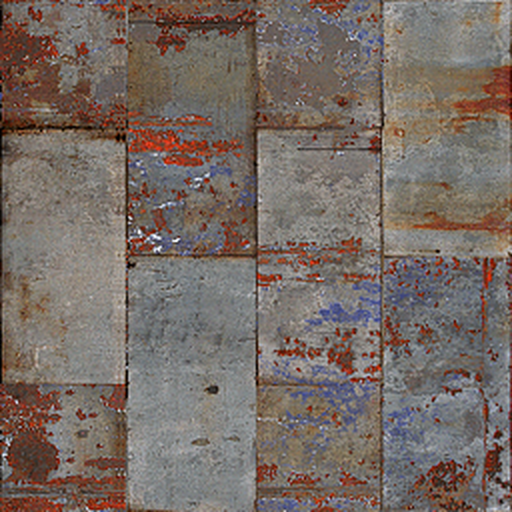</td>
<td>metalroof005b </td>
</tr>
<tr>
<td>mtl260 </td>
<td>? metalroof006a (old)?</td>
</tr>
<tr>
<td>Series break (roof textures after this newer?)</td>
<td></td>
</tr>
<tr>
<td>mtl261 </td>
<td>metalstair001a </td>
</tr>
<tr>
<td>+2</td>
<td>+1 (originally metalstair001b?</td>
</tr>
<tr>
<td>mtl263 </td>
<td>metalstair002a </td>
</tr>
<tr>
<td>Series break</td>
<td></td>
</tr>
<tr>
<td>mtl286 </td>
<td>metalwall004a 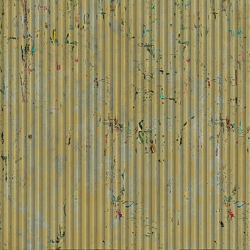</td>
</tr>
<tr>
<td>+31</td>
<td>+27?</td>
</tr>
<tr>
<td>mtl317 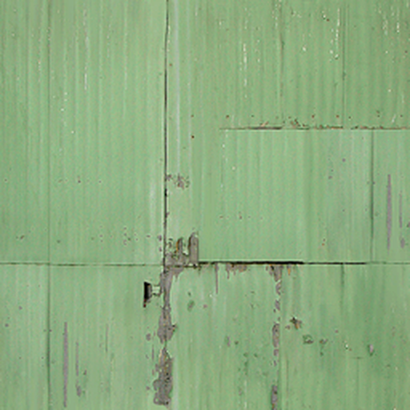</td>
<td>metalwall015a </td>
</tr>
<tr>
<td>+23</td>
<td>+31?</td>
</tr>
<tr>
<td>mtl340 </td>
<td>metalwall029a </td>
</tr>
<tr>
<td>+32</td>
<td>+27?</td>
</tr>
<tr>
<td>mtl372 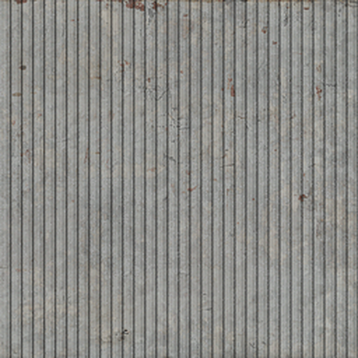</td>
<td>metalwall047a  </td>
</tr>
<tr>
<td>+10</td>
<td>+8?</td>
</tr>
<tr>
<td>mtl382 </td>
<td>metalwall053a </td>
</tr>
<tr>
<td>+3</td>
<td>+2?</td>
</tr>
<tr>
<td>mtl385 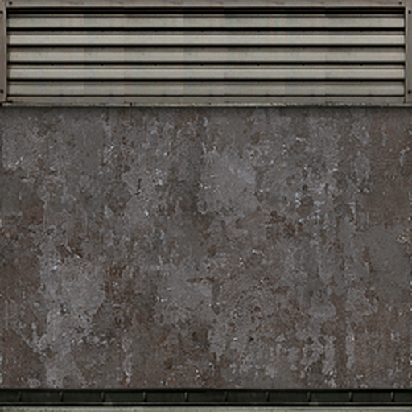</td>
<td>metalwall054b 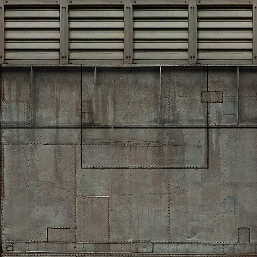</td>
</tr>
<tr>
<td>+4</td>
<td>+3?</td>
</tr>
<tr>
<td>mtl389 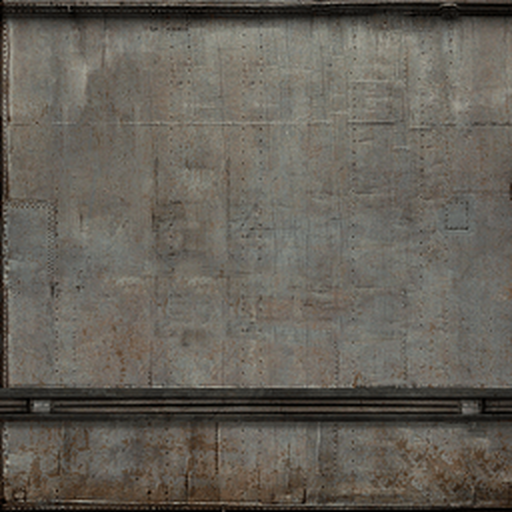</td>
<td>metalwall054e 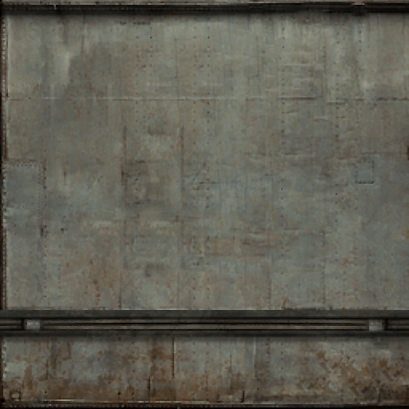</td>
</tr>
<tr>
<td>+13</td>
<td>+5?</td>
</tr>
<tr>
<td>mtl402 </td>
<td>metalwall056b </td>
</tr>
<tr>
<td>mtl403 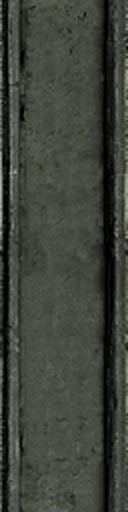</td>
<td>metalwall056c 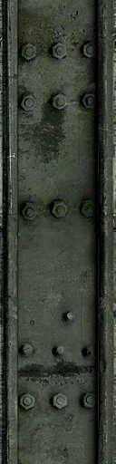</td>
</tr>
<tr>
<td>mtl407 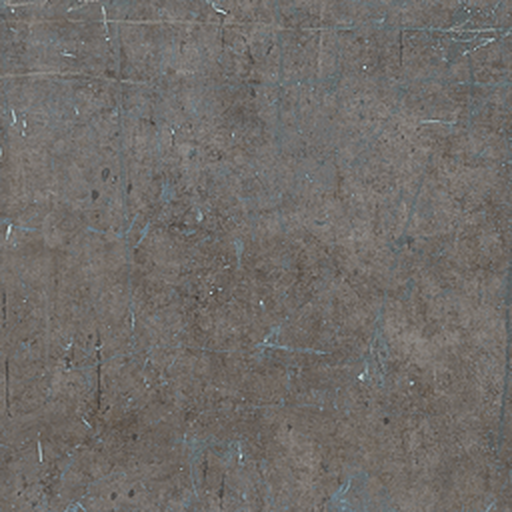</td>
<td></td>
</tr>
<tr>
<td>mtl413 </td>
<td>metalwall061f </td>
</tr>
<tr>
<td>+5</td>
<td>+5</td>
</tr>
<tr>
<td>mtl418 </td>
<td>metalwall064a </td>
</tr>
<tr>
<td>+65</td>
<td>+21</td>
</tr>
<tr>
<td>mtl483 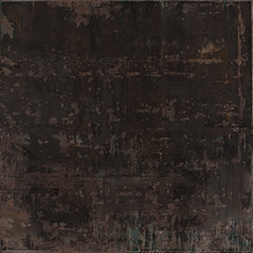</td>
<td>metalwall085a 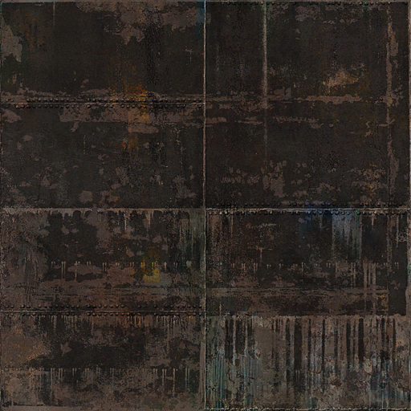</td>
</tr>
<tr>
<td>plstr123 </td>
<td>???</td>
</tr>
<tr>
<td>plstr174 </td>
<td>plasterwall034d 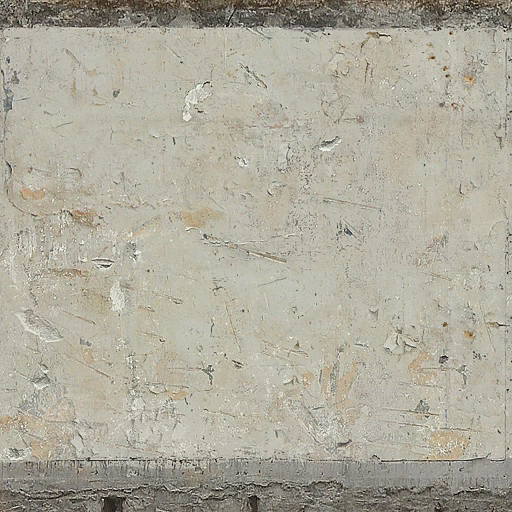</td>
</tr>
<tr>
<td>plstr201 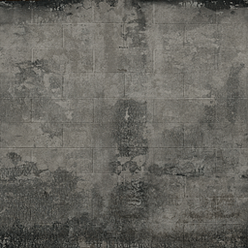</td>
<td>???</td>
</tr>
<tr>
<td>plstr222 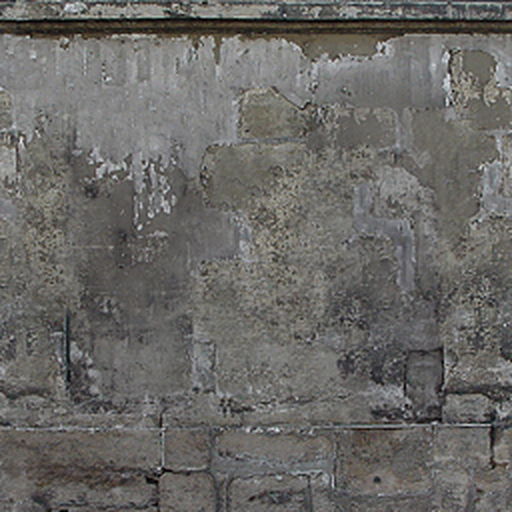</td>
<td>???</td>
</tr>
<tr>
<td>plstr233 </td>
<td>plasterwall047b </td>
</tr>
<tr>
<td>rock034 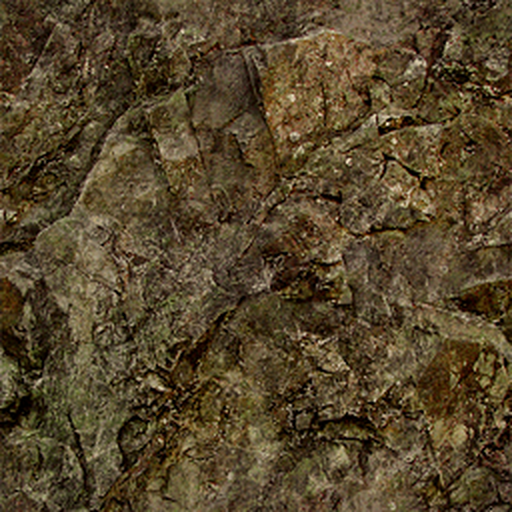</td>
<td>rockwall012b 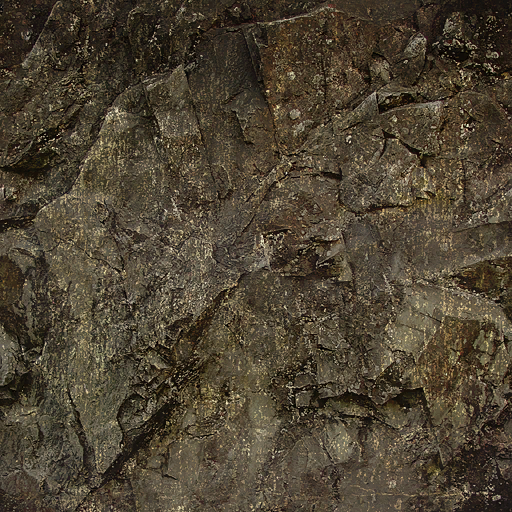</td>
</tr>
<tr>
<td>tile017 </td>
<td>???</td>
</tr>
<tr>
<td>tile023 </td>
<td>???</td>
</tr>
<tr>
<td>wood093 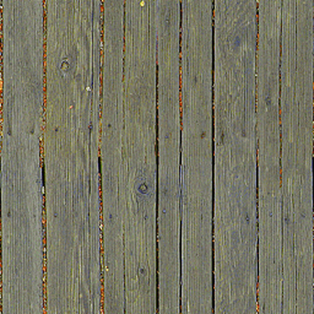</td>
<td>woodfloor006a 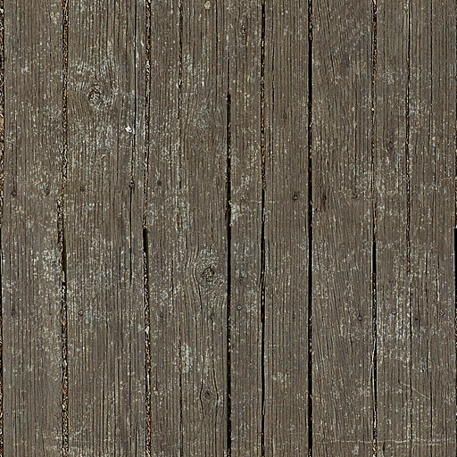</td>
</tr>
<tr>
<td>wood136 </td>
<td>woodwall009a 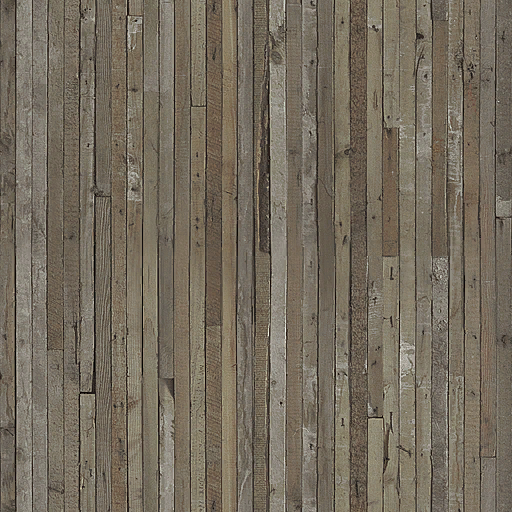</td>
</tr>
<tr>
<td>wood155 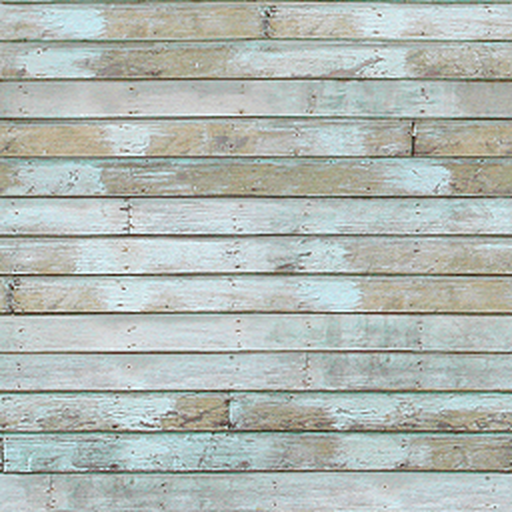</td>
<td>woodwall022a 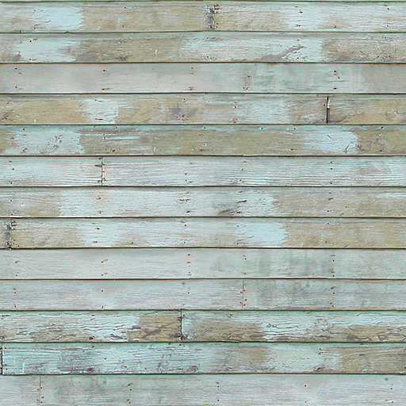</td>
</tr>
<tr>
<td>wood180 </td>
<td>???</td>
</tr>
</tbody>
</table>
